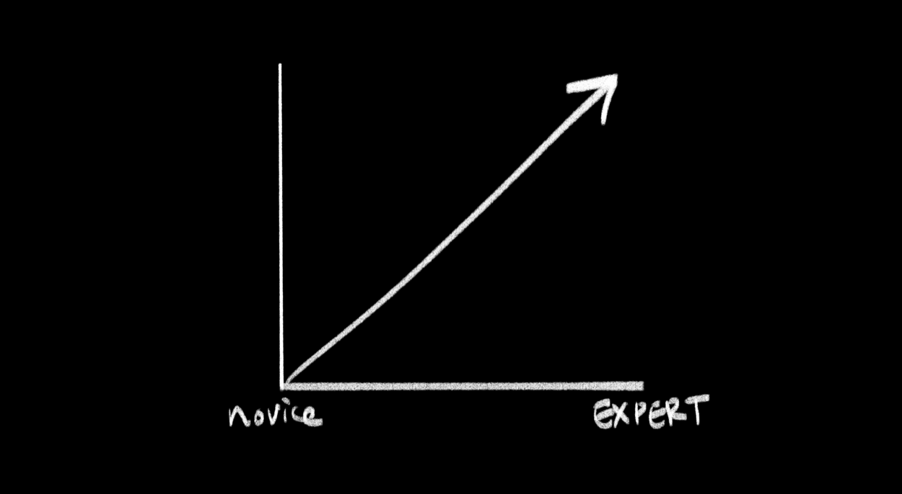
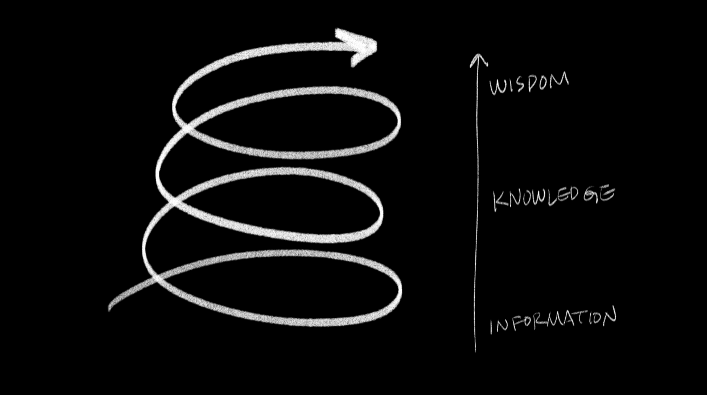

# Research Project: A Lifelong, Continuous, Nonhierarchical Model of Learning

## Background

Continuing to learn after a formal educational environment is a challenge for many people, myself included. In a formal setting, there is often a secluded environment where cohorts of students are allowed to experiment, fail, and share learned experiences. Upon graduation, often people lose this sheltered environment. Although the desire for learning is still there, people are left in the dark, wondering how they could actively continue learning.  

###Common pathways of adult learning (and their failures):
(Note: These list conscious, intentional learning, and does not include unconscious learning)

* Continuing Education Courses via Institutions:
	* Often surface level due to not enough common ground of expertise
	* Hierarchical learning model (teacher/student) is not conducive to continued learning after course ends
* Conferences:
	* Often focused on networking as opposed to learning
	* Distracting environment
	* Information is bite-sized/brief
* Workplace:
	* Priority is usually on commercial output 
	* 'Being on the clock' discourages novel/experimental approaches
	* Motivation for learning can be stunted by external forces (clients, deadlines, coworkers, etc)

## Research Topic

**How can we continue to engage in active learning after higher education?**

* How can we learn in meaningful ways from our peers?
* What research/documentation has been done before in this area, and what can we learn from it?

## Learnings from Research

####Reframing Learning

As I started to dig into the research, I realized that I had bypassed a fundamental stage: I needed to reframe my assumptions of the process of learning itself. 

I found David Cowan’s paper on *Rhythms of Learning* and its explanation to the Native American medicine wheel very helpful. It represents integrative learning, and sets up a foundation for lifelong learning.

These cycles portray how learning is a recurrent process, one that can potentially spiral to higher levels of development with each passage around the wheel. It reinforces the belief that one is in the ever-learning process all the time.

#### What Learning Should Not Look Like

David Cowan argues that this is how American education looks like where learning is regarded as something that is a convergent path, and thus has a linear direction. He argues that a much more holistic way of learning is the circular path depicted in the medicine wheel, where the path can oscillate more from novice to expert.

#### Dynamic Learning 

So if we were to look at a dimensional version of the medicine wheel, it’s more like a spiraling climb. This circularity allows a learner to go through stages of being a novice to an expert, and then start over again while acknowledging that one is continually evolving. And in this ascent there are stages: information, knowledge, and wisdom. I find this very applicable to the information age we’re in, because it’s relatively easy to gather information from the internet, but to digest it as our own knowledge we need experience in order to go climb this spiral.

#### The Concept of the Expert Novice

I encountered an intriguing keyword through my research: An "expert novice".

**Expert novice**

* “Expert novices are those who are sound masters of the procedures needed to learn new things” (Miles, 1998). 
* “Within a network of expert novices, only the essential skills of learning become automatized over time, and perhaps even those are reconsidered periodically.”

And perhaps, this is what the mindset of the learner should be. 

#### Community

The importance of community cannot be understated in the larger context. We are all parts of communities, and the biggest opportunities for learning are often in social contexts. 
This is an area where I encountered a lot of roadblock — I had a difficult time trying to find examples of communities that focused on learning that wasn’t overly related to corporate or political endeavors. What I did find out and found interesting, are these:

* **Communities of practice**: These are communities where there is an identity defined by a shared domain of interest, and the participants are practitioners. I was able to find a lot of literature on the subject, but where it falls short is that the applications are often about commercial enterprises like making task forces in a company.

* **DIY Communities**: These communities are formed as an effort to be independent from what they regard to be mainstream. Popular examples include democratic schools, free schools, and hippy communities. Where these fall short is the lack of documentation and direction, aside from their anti-establishment nature.

* **Talking Circles**: In *Using the Medicine Wheel for Curriculum Design in Intercultural Communication: Rethinking Learning Outcomes* by Marcella LaFever, it talks about indigenous Talking Circles in the context of decolonizing education in Canada. The basic premise is that there is a purposeful idea and theme to the gathering, and everyone talks in a circle, uninterrupted. It focuses on integrative conversation, which involves the exchange and creation of new meaning and feelings of cohesion. 

Where I feel a bit lost about all of these concepts and cases is that the idea seems promising — but I’m a bit unsure how it can apply to the day to day function of being part of a learning community. 

#### Integrating the Individual and Community

Coming back to the idea of the medicine wheel, it would be ideal to consolidate the best practices of the individual and combine it with the concept of the community. My vision for how this can be done is still quite opaque, but in my ideal world this is what the individual and community for learning would be like. Each individual is on their own spiral learning journey, and there is a larger spiral that consists of the community as a whole, implying that the community itself is also learning as the individuals within it are doing the same. 

## Feedback and Thoughts

I think it would be an understatement to say that many people recognize the value of learning, whether it be conscious or unconscious learning. In Clay's class, we often spoke about how learning is solidified by reflection, and how feedback is crucial in that process.

Here are some questions that came up, and thoughts in relation.

* A lot of the questions that came up while I was seeking feedback was the intended audience / target of the project. While I perceive the research to be a more broader sense, for the sake of focus I decided to concentrate on learning beyond formal education (college level and beyond).

* The concept of the medicine wheel was met with a lot of agreement. It seems that many people were intrigued by the ever evolving concept of the wheel. How this can actually be applied in a habitual/systematic sense (or if it even should be attempted) is unclear.

* The findability of learning in the meta sense can be difficult to implement even in academic institutions (e.g. "Learning how to learn"), since many people focus on the task or problem at hand instead.

* References that came up:
	*  Mary N.: There are anarchist spaces in NYC that take skillshare seriously, such as TimesUP(for bikes/political advocacy) and MayDay Space
	
	* De Angela D.: "In the beginner's mind there are many possibilities, but in the expert's there are few." *Zen Mind, Beginner's Mind: Informal Talks on Zen Medication and Practice* by Shunryu Suzuki

## Potential for Further Research

In the era of the pandemic, we are realizing that online meetups and conferences can be organized by anyone. These learnings can be beneficial in current times where digital conferences/meetups can be hosted by any individual/group.

Ideally, the research would be taken further to a state where the learnings can be adapted to create a virtual learning environment. Examples of these would include: Virtual community skillshares, digital residencies where participants are both student and educator, and asynchronous learning curriculums.

---
**References**

* [Communities of Practice](https://scholarsbank.uoregon.edu/xmlui/bitstream/handle/1794/11736/A%20brief%20introduction%20to%20CoP.pdf?sequence=1&isAllowed=y) by Etienne Wenger
	* [Notes are here](readingnotes/Communities_of_practice.md)

* [Talking Circles as a Metaphor and Pedagogy for Learning](https://www.leadershipeducators.org/Resources/Documents/Conferences/Lexington/cowan_and_adams_talking_circle.pdf) by David A. Cowan and Kathy Adams
	* [Notes are here](readingnotes/Talking_Circles.md)

* [Rhythms of Learning](assets/RhythmsofLearning.pdf) by David A. Cowan
	* [Notes are here](readingnotes/Talking_Circles.md)

* [DIY Activists: Communities of Practice, Cultural Dialogism, and Radical Knowledge Sharing](http://web.a.ebscohost.com.proxy.library.nyu.edu/ehost/detail/detail?vid=0&sid=8d064d6d-7c75-49a4-9eab-87020288e612%40sessionmgr4008&bdata=JnNpdGU9ZWhvc3QtbGl2ZQ%3d%3d#AN=EJ995824&db=eric) by David Hemphill and Shari Leskowitz
	* [Notes are here](readingnotes/DIY_Activists.md)

* [Using the Medicine Wheel for Curriculum Design in Intercultural Communication: Rethinking Learning Outcomes](assets/Using-the-Medicine-Wheel-for-Curriculum-Design-in-Intercultural-Communication.pdf) by Marcella LaFever