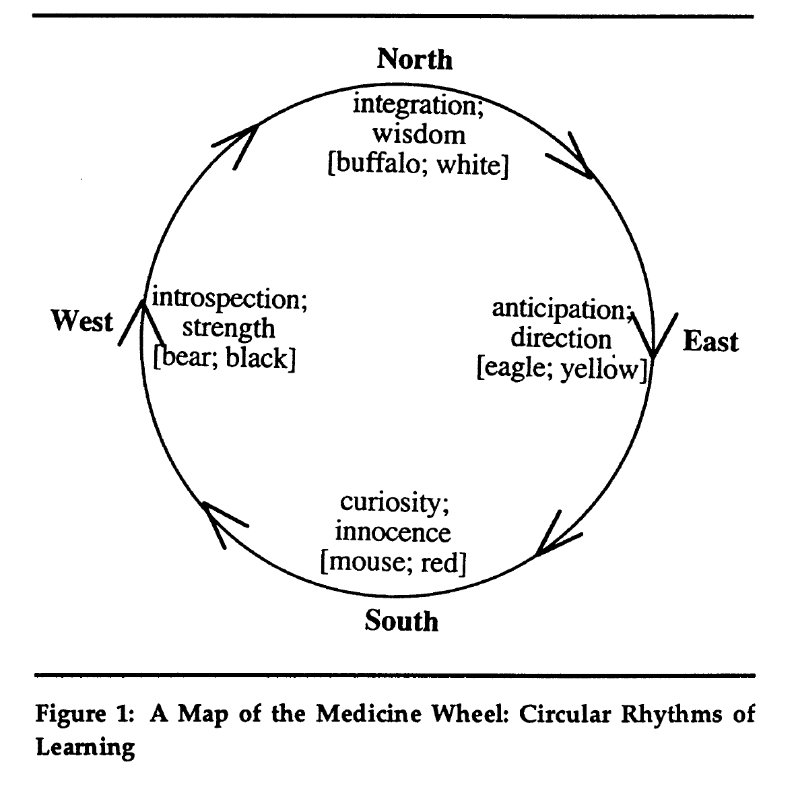
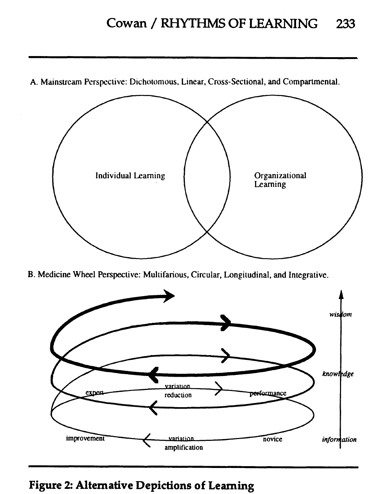
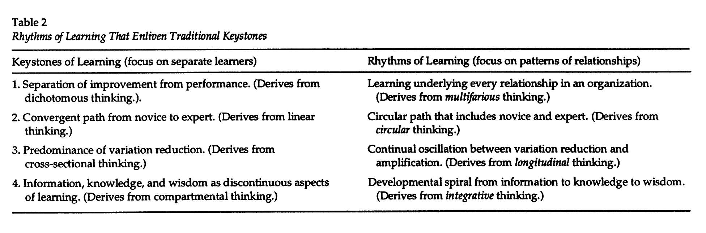
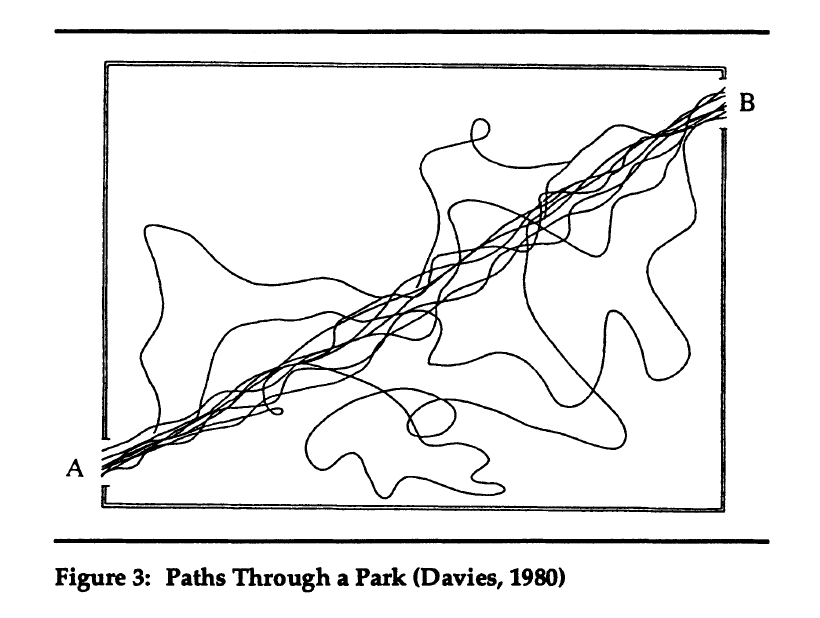
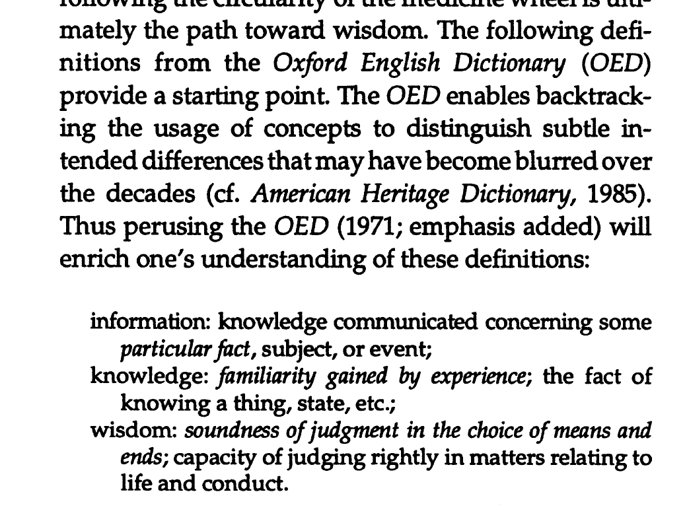

# Rhythms of Learning

Note: This has been the most helpful paper for organizing thoughts about the Medicine Wheel.

From page 226 Journal of Management Inquiry, *Rhythms of Learning*, Sep 1995

Overview of the Medicine Wheel: The Native American medicine wheel is a foundation for lifelong learning. It represents integrative learning. 

"The drawing of the wheel is not the wheel however (Korzybski, 1958). Rather, the wheel is the living, interdependent web of recurring cycles and developmental sequences that compromise our world... it is the knowing — and not just knowing about — patterns of interdependence and dynamism, yet it includes the patterns of interdependence and dynamism themselves (cf. Capra, 1983). " — page 226

"The wheel highlights the ongoing need to attach learning to experiences and contexts. " – page 227

"These cycles portray how learning is a recurrent process, one that can potentially spiral to higher levels of development with each passage around the wheel." — page 227

Emphasize on the integrity of concepts and of learning processes, and respect of the power of language (p. 230)

"Understanding integrative, circular patterns requires transcending logic and linear thought to reveal synthesis and dynamic interdependence." (p.230)

From page 233 Journal of Management Inquiry, *Rhythms of Learning*, Sep 1995

From page 234 Journal of Management Inquiry, *Rhythms of Learning*, Sep 1995

"The prescribed mental state during learning usually calls for introspection, reflection, integration, repetition, and so forth, most of which are thought to deter effectiveness when they arise during performance." (p. 234, on Keystones of Learning as opposed to Rhythm of Learning)

"Expert novices are those "who are sound masters of the procedures needed to learn new things" (Miles, 1988, p. 30)." (p. 235)

"Within a network of expert novices, only the essential skills of learning become automatized over time (Sternberg, 1985), and perhaps even those are reconsidered periodically." (p. 235)

"One way of enriching the novice-to-expert keystone is by thinking with an element of circularity." (p. 236)

From page 237 Journal of Management Inquiry, *Rhythms of Learning*, Sep 1995

"This example comes from a physicist who uses it to explain how the paths that particles in quantum mechanics travel are similar to the paths people follow through a park (Davies, 1980).... The relevance to a learning context is that too often we attend only to the well-worn paths and fail to recognize the value of variation." (p.237)

"Too often, paths are restricted because standards such as consistency, reliability, and standardization outweigh learning."(p. 239)

From page 239 Journal of Management Inquiry, *Rhythms of Learning*, Sep 1995

"Another potential social problem arising from the confusion of information, knowledge, and wisdom involves the process of accumulating knowledge without integrating it. This manifests when people know lots of different things without being competent at much of anything, that is, the accumulation of knowledge without learning (e.g. Peikoff, 1988)"(p.240)

"An expert is the person we call on when we know what the contextual circumstances demand; a wise person, on the other hand, is the one we want when we do not understand the circumstances. Wisdom enables us to maneuver more effectively through conditions of uncertainty and ambiguity, where peripheral attention and exploration are as important as focus." (p. 240)

(On combining Microscopic and Telescopic perspectives) "First, learning becomes the essence of each and every relationship throughout the course of every day; it is not something that happens only when performance is put on hold or only in certain contexts. Second, learning involves circular paths that are inherently somewhat uncertain; it is not comprised of only myopic, linear paths that converge toward predetermined ends. Third, over time learning involves continual oscillations between the amplification and reduction of variation; this rhythm cannot flow naturally under conditions that sustain an imbalance. Fourth, learning potentially moves through broad integrations over time — on a spiral path that increasingly approaches wisdom." (p.241)

"The circularity of the wheel suggests that learners must stay in motion, moving around the various directions over and over again, not only to acquire the basic skills of learning, but also to enrich understanding of what otherwise becomes static and myopic." (p.242)

