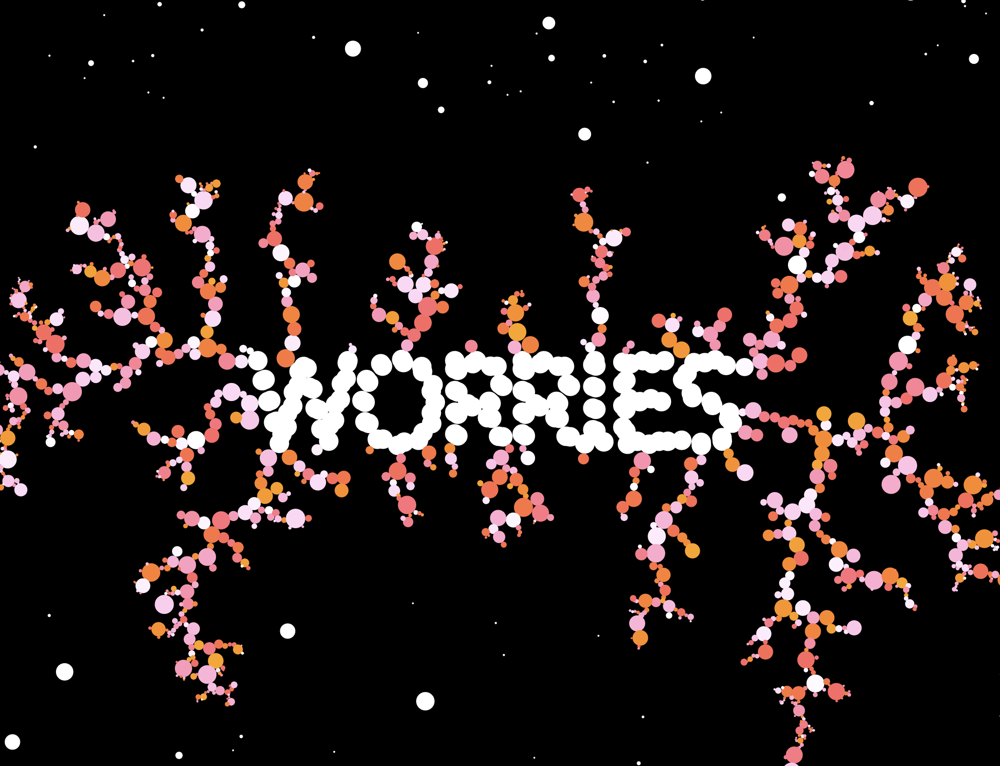
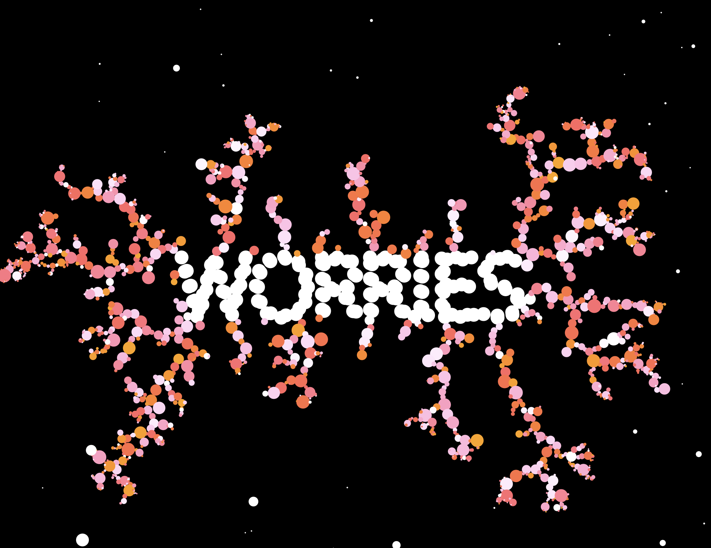

# Walkers & Diffusion-Limited Aggregation

## Documentation for Week 1 of NYU ITP's Nature of Code Class 

This week, I did all the tutorials for the [Nature of Code](https://github.com/nature-of-code/noc-syllabus-S21) class and had a bunch of fun! Understanding the code and following along wasn't a problem, but the struggle was the question of what to create with what I had learned.

The algorithm that I loved the most was 'Diffusion-Limited Aggregation'. I had a lot of fun following along with the [Coding Train Tutorial](https://www.youtube.com/watch?v=Cl_Gjj80gPE) and learned to create these amazing patterns of growth on the canvas. What to create with this?

After much procrastination and thoughts, I eventually decided on visualizing something that is abstract in my mind; the worries that endlessly seem to spawn! It seemed perfect for the 'walkers' that get stuck to a main structure.

So I created an array of points that correspond to 'worries' and tweaked a lot of parameters to get the desired color that I wanted to see in my visuals. 

My recent worries aren't too monumental, and seem cute at times (e.g. Will the co-op run out of hazelnuts soon?) but it does add up over time into a giant behemoth if I keep up the endless cycle of worrying in my head. I'm hoping that the visuals support what I was trying to portray!

### Examples of 'Diffusion Limited Aggregation: ft.Worries'

#### Code Repository is [here](https://github.com/lynneyun/ITP-Documentation/tree/master/Nature%20of%20Code/Week1/Diffusion-Limited_Aggregation_followAlong)
