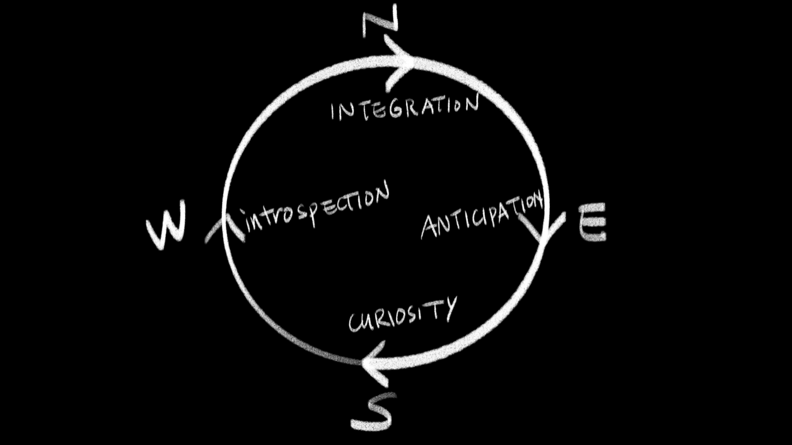
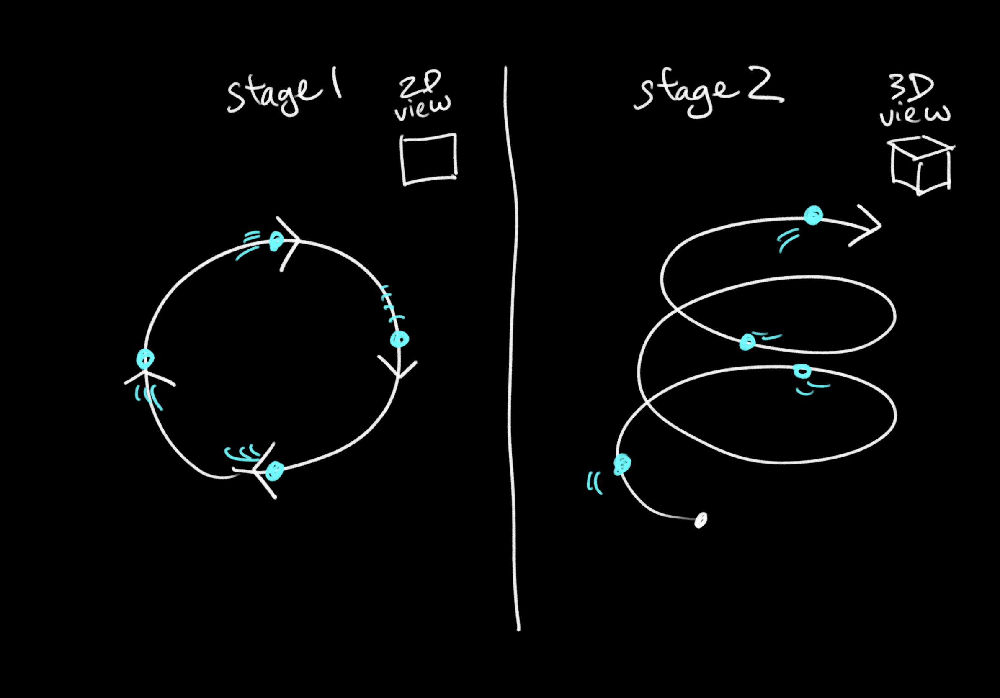

# Final Project Ideas

#### Documentation for NYU ITP's [Nature of Code](https://github.com/nature-of-code/noc-syllabus-S21) Class 

For my final project, I would love to bring to life the idea of the 'medicine wheel' that represents integrative learning. My thesis centers on my experience of learning, and I think the wheel is very inspiring to me in that it portrays a holistic framework for lifelong learning. 

### The Medicine Wheel

The medicine wheel represents the cyclical aspects of nature, and by extension the cycle of learning. As we see spring turn into winter and dusk turn into morning, we experience learning in a similar cycle. Learning starts with anticipation, but then follows a cycle that eventually turns into integration.

### A Sketch

This wheel is often shown in a flat circle for simplicity's sake, but it is said that each passage around the wheel will take you to higher levels of understanding. 

In my sketch, I would like to draw this by utilizing the learnings from the Nature of Code's [Autonomous Agents](https://github.com/nature-of-code/noc-syllabus-S21/tree/main/module05-agents) chapter. I would like each 'agent' to represent each person, and represent the person's journey of learning and following this path.

#### Some thoughts & questions:
* I'll have to be careful of the agent movements seeming mechanical/too smooth. Will need to ensure that the 'agents' move in an organic manner. Will random functions suffice?
* Will I need a central line, or should I have it fade away as more and more agents 'join' the wheel?