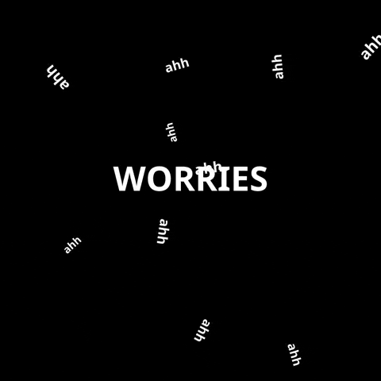
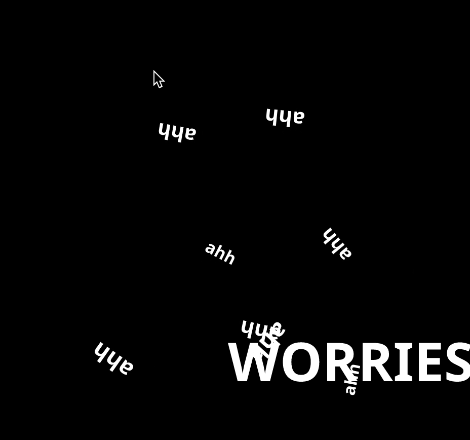

# Direction

## Documentation for Week 4 of NYU ITP's Nature of Code Class 

This week, [Nature of Code](https://github.com/nature-of-code/noc-syllabus-S21) classes covered directionality and angles. 

This week was a bit tricky in terms of what I wanted to make. I wanted to continue on with the idea of the 'worries' series I had started making. After going through so many tutorials, in the end I ended up trying to adapt one of the more basic examples.

In this sketch, the 'ahh's follow around the 'WORRIES' even when you try to get away from it by clicking around :)

#### Code Repository is [here](https://github.com/lynneyun/ITP-Documentation/tree/master/Nature%20of%20Code/Week4/direction_pointing_followalong)