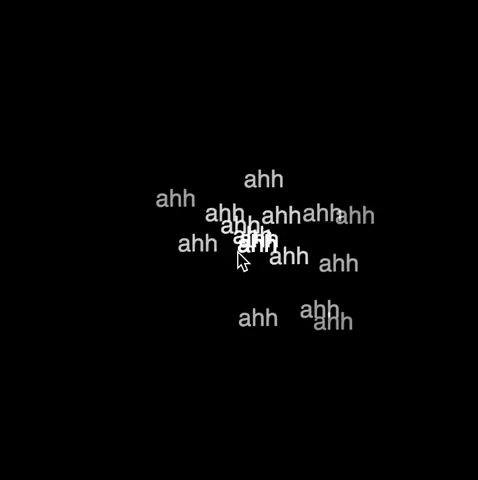

# Particles

## Documentation for Week 5-6 of NYU ITP's Nature of Code Class 

### * Project website is currently live at this address: [http://204.48.19.139:3000/](http://204.48.19.139:3000/)

As a two week project, the [Nature of Code](https://github.com/nature-of-code/noc-syllabus-S21) class covered particles and lots of advanced Javascript functionalities.

I have continued to build upon my continuing theme of 'worries' for this project also. After following along with Dan's tutorial, I first created this more 'simpler' version of 'ahh's moving around via the force of the mouse.

After that, I started to think about how I could be more expressive. Eventually, I settled on this sketch where you can click around the 'void' to create 'worry hot spots'. The worry spots change to 'ahh's and radiate the 'ahh' particles when the mouse gets too close. It's hard to explain in words, but I'm hoping this GIF does a better job!

### **You can also try out the sketch live here: [Link to website](http://204.48.19.139:3000/)**

An added bonus Easter egg is that I've utilized some new back end skills learned in this semester's Connect! class (with Shawn Van Every) to save the last 6 clicks that people have made on the website. So when you visit, you should see the worries of people that have visited the site before you, so to speak :-)

#### Code Repository is [here](https://github.com/lynneyun/ITP-Documentation/tree/master/Nature%20of%20Code/Week5-6/code)