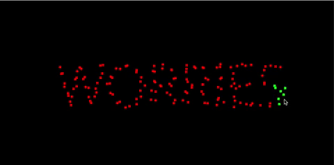
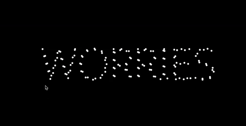
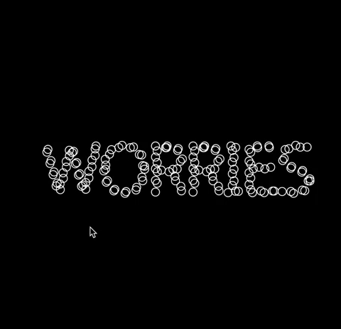

# Agents & Steering Behaviors

## Documentation for Week 7-8 of NYU ITP's Nature of Code Class 

Here is another two week project from the [Nature of Code](https://github.com/nature-of-code/noc-syllabus-S21) class! This time, it was an exciting topic of agents moving around, like schools of fish or flocks of birds.

Looking through the tutorials, I was most drawn to the flocking coding challenge in the last video. After painstakingly wrapping my brain around how it all worked, I set out to think about what I could do. 

First of all, I wanted the viewer to be able to participate in the sketch (unlike birds you see in the sky :-)). So combining code from the [Steering Behavior Coding Challenge](https://thecodingtrain.com/CodingChallenges/059-steering-text-paths.html), I made the 'boid' agents flee the mouse. 

Then, I was curious about how I could continue my theme of the word 'worries'. I settled on a solution where the word would appear in a static manner, and the viewer would kickstart the flock of 'boid' movements.

Here's a debugging sketch where you can see the static (red) agents turning into active (green) agents:

Then, I tried out a few visual representations of the agents. Funny enough, it seemed less appealing when the agents were more realistic.

Here's an example of the agents having a sense of direction— reminds me of ants in a not-so-great way! :(

Here's where I ended up with. The agents flock in a sudo-random behavior (the cohesion/alignment/separation values are always changing as time passes), so the movement could seem more organic... but the orientation is always the same so it doesn't feel too ant-sy :)

#### Code Repository is [here](https://github.com/lynneyun/ITP-Documentation/tree/master/Nature%20of%20Code/Week7-8/code)