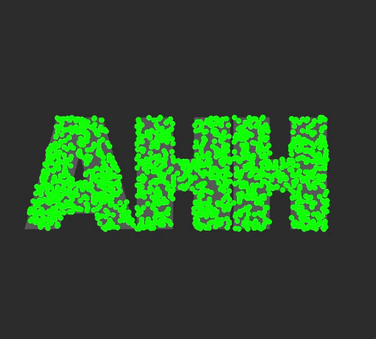
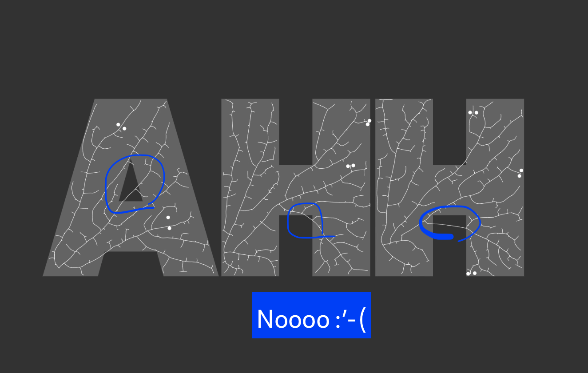

# 'Cellular Automata' Tree

#### Documentation for NYU ITP's [Nature of Code](https://github.com/nature-of-code/noc-syllabus-S21) Class 

### Here is [a link to the live sketch](https://editor.p5js.org/lynneyun/present/4Qua6Z_xW) if you want to see it in action!

For this week, I was interested in the ['space colonizing tree'](https://thecodingtrain.com/CodingChallenges/017-spacecolonizer.html) demo and wanted to find a way to use it in a typographic format. 

I decided on an idea to try to create a sketch where the trees would fill in a letter shape. This was a big challenge for me, as this meant I'd have to really dig into how the demo code was working. I'm happy to report back that I added many changes in order to get my vision going, including the following:

* added a background layer to check that the tree was 'on' the letters
* there are now multiple trees for each letter (in order to make it fill in the letter shapes)
* added functionality so that the tree starts on multiple random parts of the letter

### The debugging mode view:

As the code gets longer, I am really feeling the importance of creating debugging modes for sketches. It makes the process a bit longer, but I think it ends up saving more time than it takes (a lesson I had to learn this week!). The red circles show where the 'tree' is starting out, and the green circles show the 'leaves'. And in debugging mode, the outlines for the letter shapes are also shown.

### Some Learnings: 

Another thing that I learned is that sometimes, I just should tweak the parameters instead of trying to over-code. For instance, I spent hours trying to force the branch that were 'escaping' to move elsewhere, only to find out that I could just create more 'trees' with my existing code and that would solve my problem!

### Current Iteration of the Sketch:

This is where the sketch is currently at. You can see that there are about 5 'trees' in each letter, and they do a pretty good job of filling in the letter so that each glyph shape is recognizable. I'm pretty happy with the results :-) 

#### Code Repository is [here](https://github.com/lynneyun/ITP-Documentation/tree/master/Nature%20of%20Code/Week9/code)

#### Link to the p5.js Web Editor sketch is [here](https://editor.p5js.org/lynneyun/present/4Qua6Z_xW)