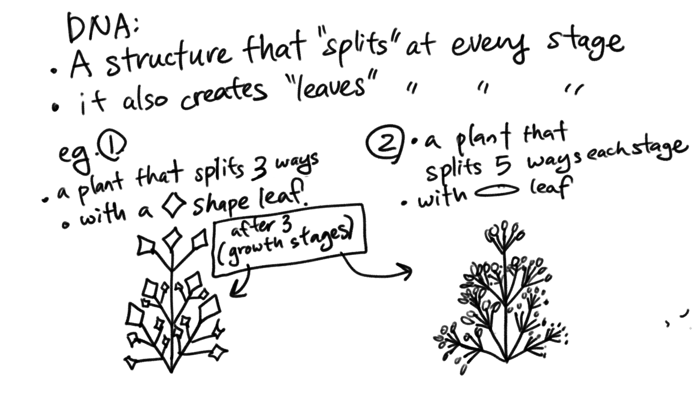
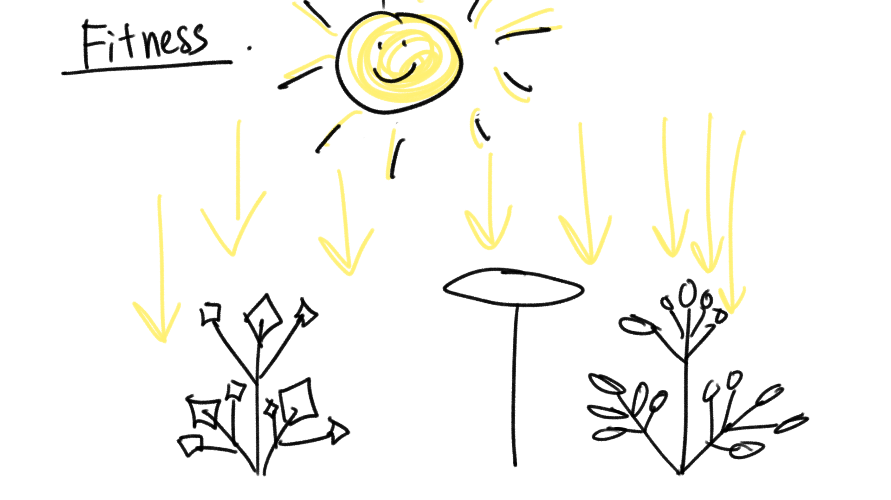

#Thought Experiment:
## Genetically Engineering a Plant through Code

### Scenario:

During the last year, I have been fascinated by the world of plants. There are so many different types of plants out there, each with specific shapes, sizes and colors. Although most in natural habitats have been optimized for survival, there are many variants that are bred by people for their agricultural or ornamental qualities. Thinking about the wide varieties of plants out there, it got me wondering: what new forms of plants could we come up with if we tried to ‘genetically engineer’ a plant structure through code? 

### Phenotype:

Loosely speaking (from a very non-scientific standpoint), I tend think there are a four core visual elements in a plant: The roots, stems, branches, and leaves. For the purposes of this scenario, I think the roots are not as important as the other three. So the ‘expressions’ of our ‘DNA’ structure will focus on the stems, branches, and leaves.

* **Stems**: This is where the plant grows from. Depending on the plant, there may be a few stems that ‘clump’ together to make one plant unit. Branches will be attached to the stems. A big parameter to consider is the distance between each branch.

* **Branches**: This is the part of the plant that can vary in terms of angle. With a lower angle, the plant has the possibility to spread wider. With a higher angle, the plant has a possibility to grow taller. Each branch also has a potential to be recursive, meaning it can grow more branches onto itself. Leaves will be attached to each branch.

* **Leaves**: This is where the plant structure ends. Leaves can come in a variety of shapes. It can be wide or narrow. Depending on the shape, a branch may have differing amounts of leaves. (E.g. a branch may have room to support 3 big leaves or 9 small leaves).

### Genotype:

If we were to try to encode the Phenotype above into code, what would it be? I visualize something like this:

A “plant” object that contains the information for:
How many stems it will have
Internodal spacing for the branches (e.g. how far apart are they on the stem)
How many ‘splits’ will happen when the branch occurs
The angle of the branching
How many times the branching will happen
The shape and size of the leaves

### Fitness function: 

The fitness function can be many things in our digital world (where rain may come sideways and the earth can be up instead of down), but I think for the first experiment it should be a bit more straightforward so that we may get results that will be closer to real-world plants. Of course, a plant that we artificially made is nothing like a plant from nature, but I think if we get too far from the original inspiration, we may end up with results that don’t resemble plants... which is not my intention for this experiment.
I foresee the fitness function to be the amount of sunlight a plant can get. It has the advantage of the fitness measure being relatively straightforward — if a straight line was drawn from the sky, which plant has the most amount of leaf surface area? Now, we have to consider that in nature, plants that are under the canopy get less light. To mimic this, perhaps the leaves that are underneath another get reduced amount of ‘sunlight’.

### Mutation and Crossover Considerations:

As with nature, I think crossovers should be fairly common, and mutations a lot less so. Perhaps there is a good chance of a plant being made via a crossover, and mutations are very rare in comparison.
