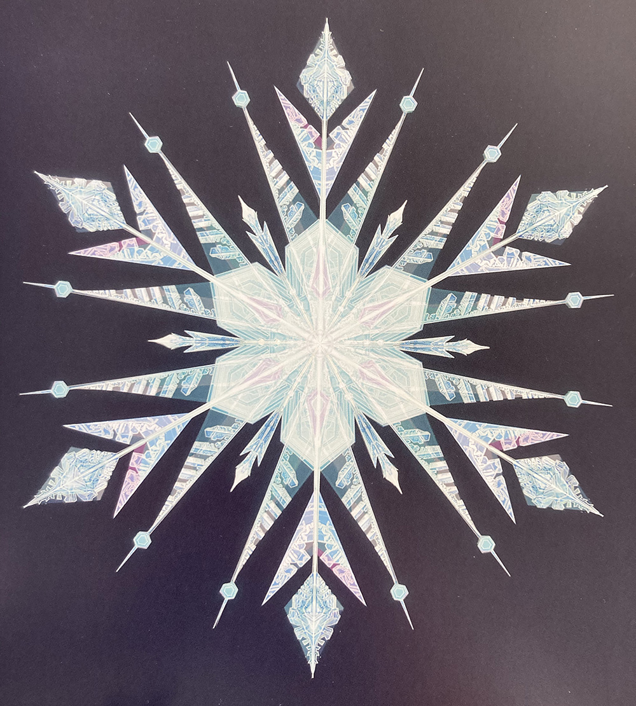
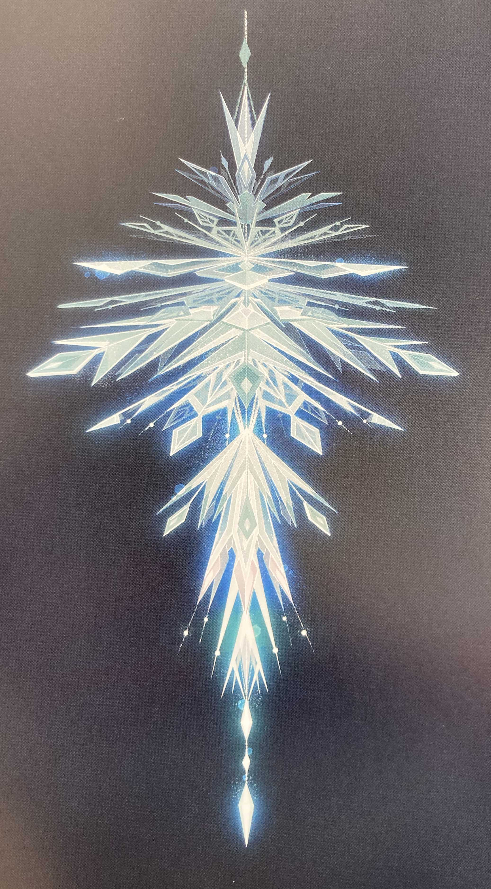
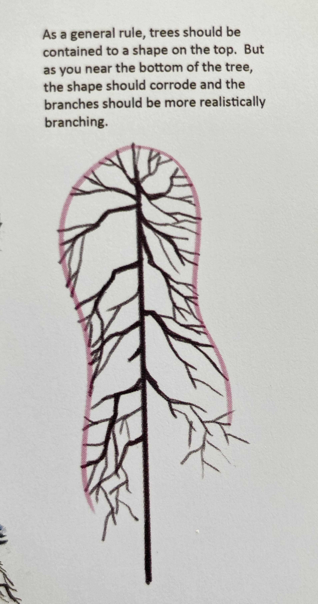

# Final Project for A2Z: CFG Fractals

### Conceptual References:

* *Why Fractals Are So Soothing* from [The Atlantic](https://www.theatlantic.com/science/archive/2017/01/why-fractals-are-so-soothing/514520/)

* [14 Amazing Fractals Found in Nature](https://www.treehugger.com/amazing-fractals-found-in-nature-4868776)

### Technical References:

* [Algorithmic Beauty of Plants](http://algorithmicbotany.org/papers/abop/abop-ch1.pdf)
* [Nature of Code: Chapter 8 Fractals](https://natureofcode.com/book/chapter-8-fractals/)

### Visual References:
(All from the Pixar *Frozen* art book)

### To Do Next:

* Read *[An Introduction to Fractals](http://paulbourke.net/fractals/fracintro/)* by Paul Bourke
* Watch the TED Talk [Fractals: a world in a grain of sand](https://www.youtube.com/watch?v=DHNooAe44dY) by Ben Weiss

### Questions:
* It seems that Dan has an exercise that seems to imply that individual parts can be moved, is this for non-CFG fractals or can this be applied to CFG fractals as well? And on a related note, is it possible to keep track of each 'branching' point (or is it impractical with CFG)? 