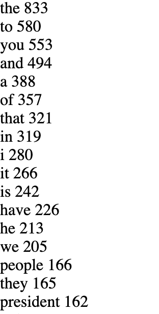
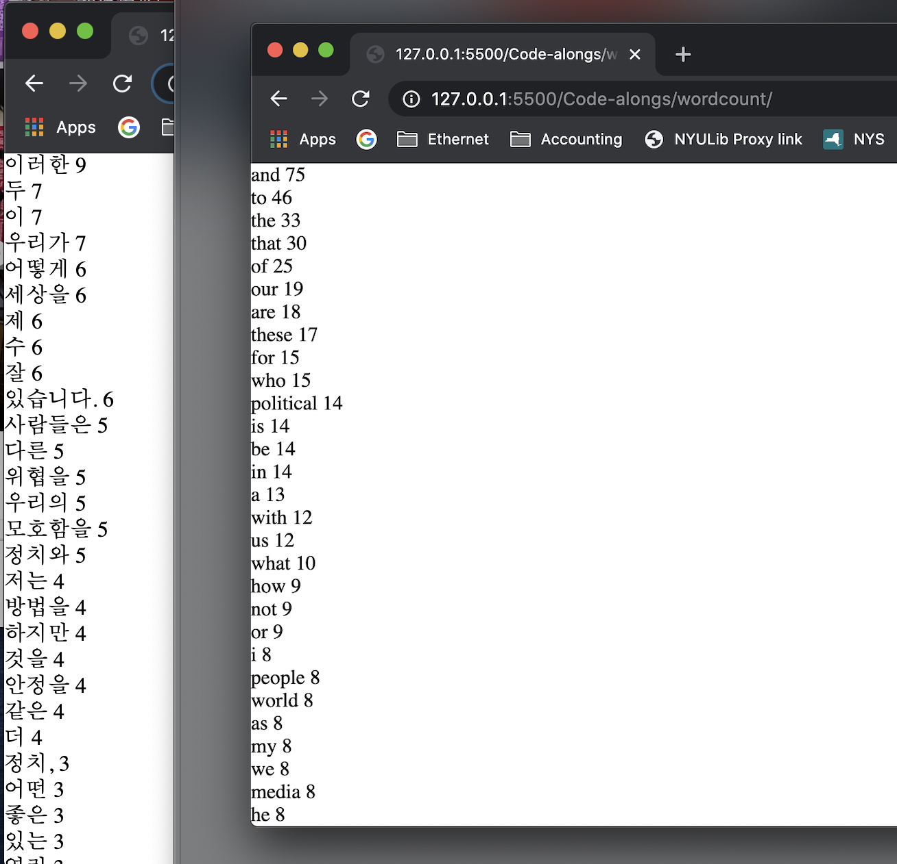

# Trying out Word Counting

In [this week's class](https://github.com/shiffman/A2Z-F20/tree/main/04-word-counting#reading) with Dan, we learned about word counting.

### Note: The code for the assignment is uploaded on Github [here](https://github.com/lynneyun/ITP-Documentation/tree/master/Programming_from_A_to_Z/Session04/code).

## Presidential Debate Word Count

The first thing I did after learning about word counting was trying it out on a transcript for the first presidential debate. (Source: [Monadnock Ledger-Transcript](https://www.ledgertranscript.com/First-presidential-debate-Trump-Biden-full-transcript-36636856)

Here is a list of the top most used words:

 

## TED Talk English–Korean Word Count Comparison
Then, I tried using the word counting code on a transcript of a TED Talk, *The psychological traits that shape your political beliefs* by Dannagal G. Young.
 

What I learned from trying out the existing code on the Korean transcript is that, well, it didn't work! It would only give me the couple of English words that were in the transcript. 

Upon digging deeper into why it wasn't working, I figured out that this was because of the RegEx formula I was using. I was using `[^\w']+` to `.split` the English transcript, which meant I was using any character that wasn't a word character or an apostrophe. But as I googled further, I learned that a 'word character' means a character from a-z, A-Z, 0-9 — meaning that it was only thinking of the Latin alphabet as words!   

After thinking about it further, I ended up using `\s+` as the RegEx expression, splitting the Korean transcript through spaces. Since Korean doesn't use dashes or apostrophes, it ended up working pretty well. 

Here is a list comparison of the top most used words (Korean on left, English on right):

 

## Reflecting

### For the debate word count

What I mainly learned is that taken out of context, the words have a harder time retaining the meaning. For example, I watched the 90 minute presidential debate on its entirety, so I assumed that I'd be able to make some sense out of the most commonly used words. However, it turned out that it wasn't the case. Looking through the word count, I can see the flaws in the traditional 'word bubble' method of showing highlights from speeches and debates!

### For the Korean and English TED talk transcript word count comparison

First of all, I was surprised that the definition of what a 'word character' is very Latin-centric. (The websites covering tutorials didn't mention this explicitly either!). Secondly, while I was comparing the word count list I found myself very puzzled. As it turns out, Korean has postfixes that are often attached to words, skewing the word count at a glance. For example, 'world' is mentioned 8 times in the English transcript, but in the Korean one you can see '세상을' mentioned 6 times (which means 'world', but used in subject-form.) This may have been because the other two times, 'world' was used in another form somewhere else. Looking at this, I was tempted to split the words by type of word (verb, subject, etc). But then, wouldn't that be skewing the meaning of words further? 

This assignment left me thinking a lot about how algorithms for analyzing text are very English (and by extension, Latin) focused, and needless to say I was disheartened! :-(