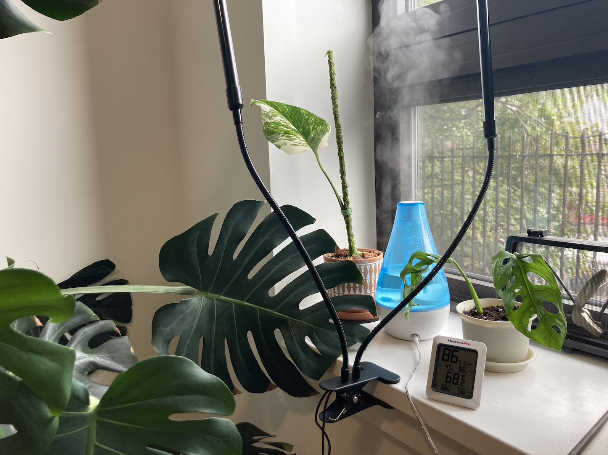
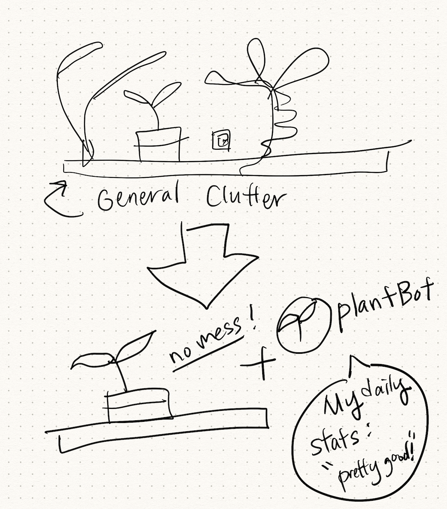

# Creating a Bot

In [this week's class](https://github.com/shiffman/A2Z-F20/tree/main/05-bots) with Dan, we learned about making bots in Twitter and Discord.

### Note: The code for the assignment is uploaded on Github [here](https://github.com/lynneyun/ITP-Documentation/tree/master/Programming_from_A_to_Z/Session05-06/code).

## Initial Idea

I tried to look around my immediate surroundings for something that I COULD definitely use a little robot helper with. Something that came to mind was my very cluttered windowsill, filled with gadgetry.

I have become quite the amateur horticulturalist, and I check my setup daily for the perfect temperature, light level, and humidity. The problem is that my windowsill is now a mess of wires and unsightly instruments.

What if my bot could tell me throughout the day how it was doing? I think my problem is pretty straightforward — for the monstera plants I am growing, these are the stats that I need:

* Humidity: 50%~70%
* Temperature: 68~80F
* Light: Bright, Indirect Light (need to research lux amount!)
* (And a photo would be nice sometimes)

So, great! All I would need to do would be to set up a Pi or something similar to take those measurements, send it to my bot, then I could have my plant bot!

## Then, the Technical Hurdles

As can expected, the reality of technical hurdles came crashing down. I tried to scale back my project so I could ACTUALLY achieve this within the assignment timeframe.

