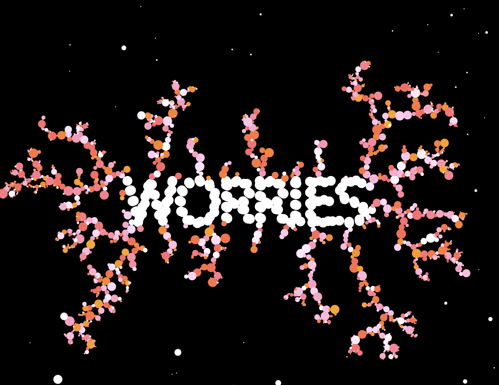

# (WIP) Narrative Plans for Thesis Project

Feb 16th, 2021

-------

## Intro Slide: Thoughts about Learning
[scene 1]

[TBD Image]

**Text:** Learning is something we engage in our everyday lives, yet it is something we may not be thinking about in a conscious manner. I'm not only referring to studying in a classroom or reading a how-to book; I'm talking about all the times we have tried to figure out something new. We are always learning on a daily basis, whether it be trying to figure out how to hang a picture frame on a wall or figure out how to keep the puppy preoccupied during a Zoom call. In this era of the pandemic, we are seeking out ways to be ever self-aware. It may seem that not much has changed; but it is true that we are continually in the process of becoming; that is, continually learning all the time. 

## What Learning is Not
[scene 2]

**Text:** David Cowan argues that this is how American education looks like where learning is regarded as something that is a convergent path, and thus has a linear direction. He argues that a much more holistic way of learning is the circular path depicted in the medicine wheel, where the path can oscillate more from novice to expert.

## Reframing Learning
[scene tbd]

**Text:** Let's try to frame our thinking around this simplified diagram of the Native American medicine wheel. It represents integrative learning, and sets up a foundation for lifelong learning.

These cycles portray how learning is a recurrent process, one that can potentially spiral to higher levels of development with each passage around the wheel. It reinforces the belief that one is in the ever-learning process all the time.

## Dynamic Learning
[scene tbd]

**Text:** So if we were to look at a dimensional version of the medicine wheel, it’s more like a spiraling climb. This circularity allows a learner to go through stages of being a novice to an expert, and then start over again while acknowledging that one is continually evolving. And in this ascent there are stages: information, knowledge, and wisdom. I find this very applicable to the information age we’re in, because it’s relatively easy to gather information from the internet, but to digest it as our own knowledge we need experience in order to go climb this spiral.

## Integrating the Individual and Community
[scene tbd]

**Text:** Coming back to the idea of the medicine wheel, it would be ideal to consolidate the best practices of the individual and combine it with the concept of the community. My vision for how this can be done is still quite opaque, but in my ideal world this is what the individual and community for learning would be like. Each individual is on their own spiral learning journey, and there is a larger spiral that consists of the community as a whole, implying that the community itself is also learning as the individuals within it are doing the same.

# [WIP]

example sketches (also wip)

[live demo here](https://editor.p5js.org/lynneyun/present/8tPVZTkGF)

