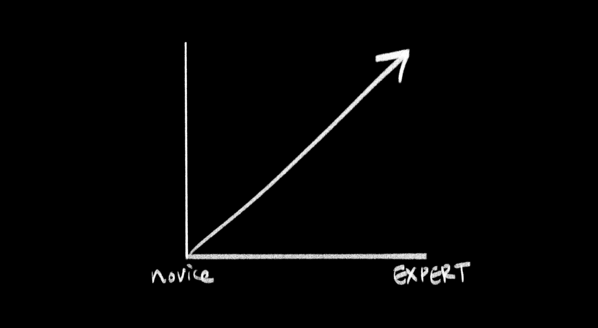
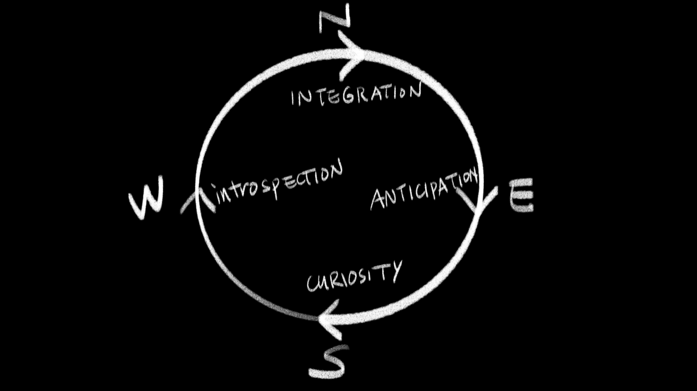
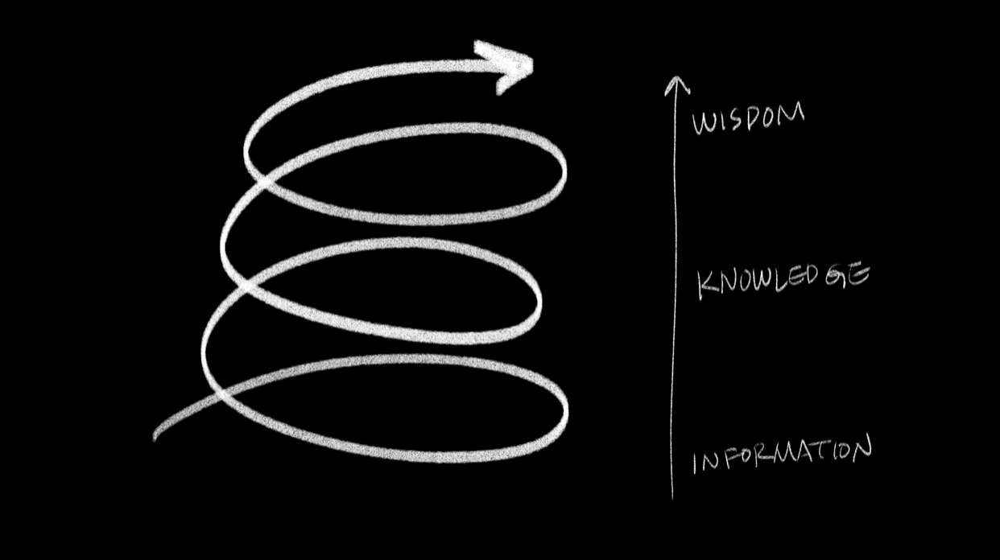
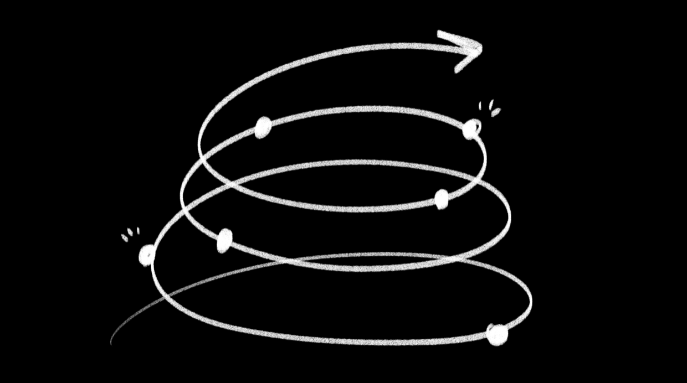

# (WIP) Narrative Plans for Thesis Project

March 21th, 2021

-------

## Intro Slide: Thoughts on Learning from a Lifelong Learner
I've always thought of myself as someone who loves to learn, study and experiment with new skills and hobbies. I've embarked on learning adventures from everything I've always loved (like drawing) to things that I used to be scared to death of (like dancing). Here are a few things I've learned and felt along the way.

##1. Learning is Everywhere, All the Time

Learning is something we engage in our everyday lives, yet it is something we may not be thinking about in a conscious manner. I'm not only referring to studying in a classroom or reading a how-to book; I'm talking about all the times we have tried to figure out something new. We are always learning on a daily basis, whether it be trying to figure out how to hang a picture frame on a wall or figure out how to keep the puppy preoccupied during a Zoom call. In this era of the pandemic, we are seeking out ways to be ever self-aware. It may seem that not much has changed; but it is true that we are continually in the process of becoming; that is, continually learning all the time. 

## 2. Why Do I Love to Learn?
[scene 2]

Learning can be challenging, but the process of learning allow me to feel the thrill of accomplishment (and thus find it addicting). For instance, I used to stay up all night playing video games as a kid. If I ever came across a particularly difficult game boss, I would go to a bookstore and try to study game guides, and tried to analyze and memorize the moves of the video game character in question. Then, armed with all my newfound nerd knowledge, I'd defeat the boss and feel a huge sense of achievement when I progressed in the game. I probably didn't think of it as "learning" at the time, but it is definitely learning in the classic sense. I definitely see a lot of parallels of my video game obsession later in life. (I want a porch in my backyard although I have no idea how to make it. Let me look up 100 Youtube videos and DIY it!) 

## Learning is Tied to My Self-Identity

Sometimes learning something new (or pausing to pursue a subject) bring about feelings of guilt or loss. On a conscious level, I am aware that there are only so many hours in the day and I can't do everything I once planned to do. However, I can't help but feel that I am disappointing a small part of myself. For instance, for most of my life, I'd prided myself on being an avid reader. However, during the pandemic it's slowly given way to my newfound obsession for rare houseplants. In my spare time, I take care of the hundred or so plants, read blog posts about houseplant care, and constantly rearrange my plant shelves (much to my partner's annoyance). As much as I enjoy it, I can't help but feel a pang of guilt whenever I get email newsletters about new books. I swear that I haven't abandoned my love of books, but I sure do feel guilty. 

## 4. Learning can bring Anxiety

Learning often brings anxiety for me. Often when I start out on something, I can't help but ask myself, "Am I wasting my time? Will I be any good? What if I embarrass myself, is this even worth trying?" Sometimes it consumes my day and it becomes part of my self-doubt repertoire. 

## 3. Learning is Not A Linear Process

David Cowan argues that this is how American education looks like where learning is regarded as something that is a convergent path, and thus has a linear direction. He argues that a much more holistic way of learning is the circular path depicted in the medicine wheel, where the path can oscillate more from novice to expert.

## 4. Reframing Learning
[scene tbd]

**Text:** Let's try to frame our thinking around this simplified diagram of the Native American medicine wheel. It represents integrative learning, and sets up a foundation for lifelong learning.

These cycles portray how learning is a recurrent process, one that can potentially spiral to higher levels of development with each passage around the wheel. It reinforces the belief that one is in the ever-learning process all the time.

## Learning is Dynamic
[scene tbd]

So if we were to look at a dimensional version of the medicine wheel, it’s more like a spiraling climb. This circularity allows a learner to go through stages of being a novice to an expert, and then start over again while acknowledging that one is continually evolving. And in this ascent there are stages: information, knowledge, and wisdom. I find this very applicable to the information age we’re in, because it’s relatively easy to gather information from the internet, but to digest it as our own knowledge we need experience in order to go climb this spiral.

## Learning is often about the Surrounding Community

Learning often means that you become part of the community. We see examples of this all the time, whether it be intentional or unintentional, formal or informal. I've consciously joined communities before, such as when I applied to a college and became part of the art school during undergrad. I've also unintentionally become part of an informal learning community, such as exchanging care tips for houseplants on Facebook groups. What initially started out as casual social media browsing eventually turned into a continuous exchange of 

## Integrating the Individual and Community
[scene tbd]

		**Text:** Coming back to the idea of the medicine wheel, it would be ideal to consolidate the best practices of the individual and combine it with the concept of the community. My vision for how this can be done is still quite opaque, but in my ideal world this is what the individual and community for learning would be like. Each individual is on their own spiral learning journey, and there is a larger spiral that consists of the community as a whole, implying that the community itself is also learning as the individuals within it are doing the same.

# [WIP]

example sketches (also wip)

[live demo here](https://editor.p5js.org/lynneyun/present/8tPVZTkGF)

