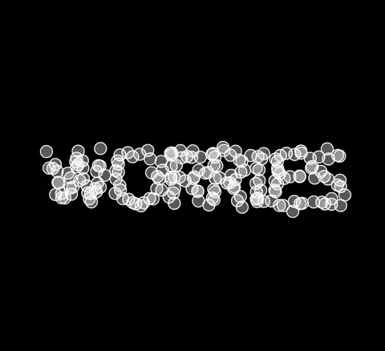

# Narrative Plans for Thesis Project

Feb 16th, 2021

-------

## Thoughts about Learning
[scene 1: Title slide]

Learning is something we engage in our everyday lives, yet it is something we may not be thinking about in a conscious manner. I'm not only referring to studying in a classroom or reading a how-to book; I'm talking about all the times we have tried to improve upon something. The mini story arcs of "exposition, rising action, climax, and resolution" that we experience on a daily basis.

# [WIP]

example sketches (also wip)

